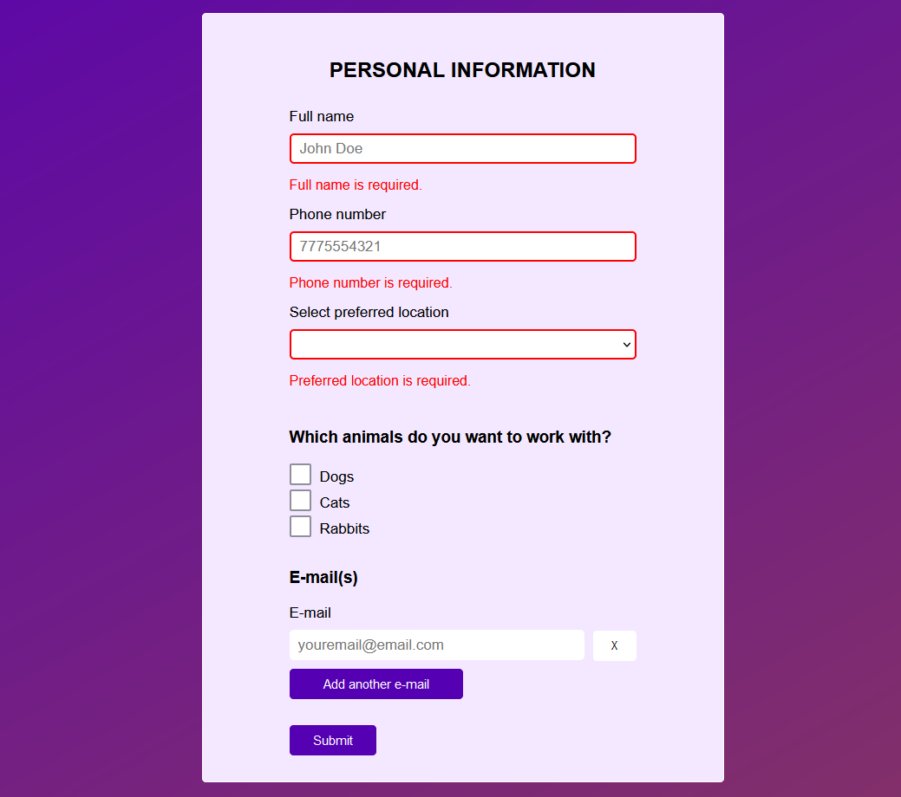
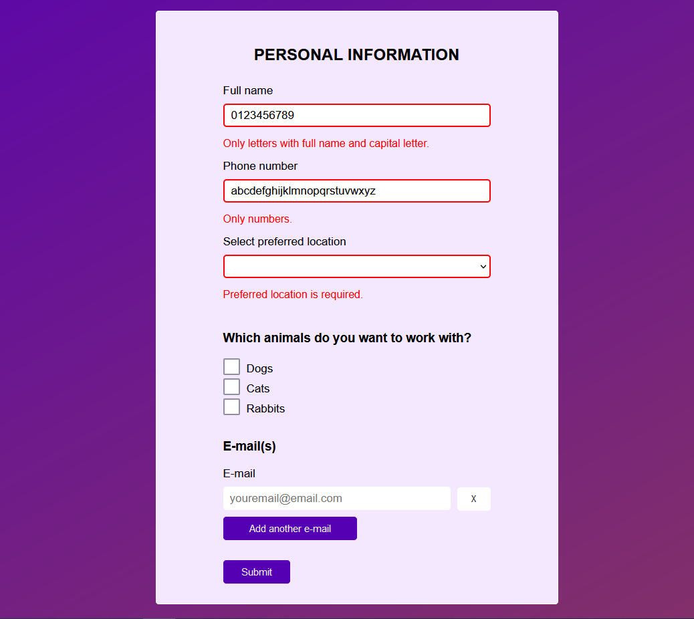
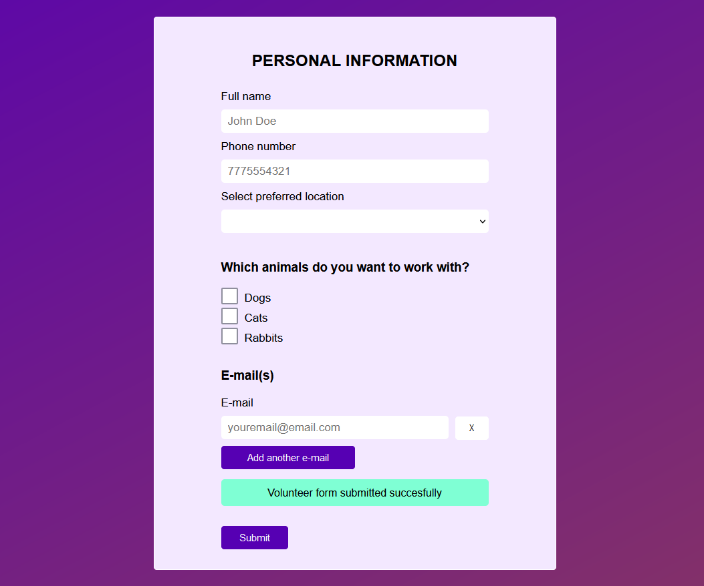

# Angular Volunteer Form 

Angular volunteer reactive form with validators.

## Browser Compatibility

All of the latest versions of <b>Chrome</b>, <b>Firefox</b>, <b>Edge</b> and <b>Opera</b> browsers are supported.

## Installation

#### Steps to install

<ol>
  <li>download the folder/git clone the repo</li>
  <li>cd root directory of the folder</li>
  <li>npm install</li>
  <li>ng serve -o</li>
</ol>

## Screenshots

Volunteer form with required validators.

Volunteer form with only letters with full name and capital letter and only numbers.

Volunteer form with a message after the submitted form. If user does not fill in all the fields, the form will not be submitted.

See code <a href="https://github.com/veronikagregorec/angular-volunteer-form/tree/main/src/app" target="_blank">here</a>

[Back to the top](#angular-volunteer-form )
